# GitHub Workflow Blueprint for Claude Code

**Production-ready GitHub Actions + Claude Code automation blueprint** that takes you from planning to deployment with maximum developer experience.

[](LICENSE)
[]()
[]()

---

## 🎯 What is This?

A comprehensive, copy-paste GitHub Actions workflow blueprint that automates your entire development lifecycle:

- **📋 Planning** → Claude Code plans automatically become GitHub issues
- **🌿 Branching** → Issues auto-generate feature branches
- **✅ Quality** → Automated PR checks (lint, test, type-check)
- **🔄 Tracking** → Bidirectional sync between PRs and project boards
- **🚀 Deployment** → Release gates with automatic issue closure

**Perfect for:**
- 🌟 Solo developers wanting professional workflows
- 👥 Small teams needing automation without complexity
- 🏢 Enterprises requiring flexible, scalable solutions

---

## ✨ Features

### 🤖 Automated Task Management
- Convert Claude Code plans to GitHub issues (max 10 tasks)
- Auto-create feature branches with smart naming
- Sync issue status with PR lifecycle
- Close issues automatically on production deployment

### 🔒 Built-in Safety
- **Fork safety**: Read-only operations for fork PRs
- **Rate limiting**: Circuit breaker pattern (50+ API calls minimum)
- **Idempotency**: All operations safe to retry
- **Debouncing**: 10-second delays prevent infinite loops

### 🎨 Flexible Branching
Supports three strategies out of the box:
1. **Simple**: `feature → main` (small teams)
2. **Standard**: `feature → dev → main` (recommended)
3. **Complex**: `feature → dev → staging → main` (enterprise)

### 📊 Project Board Integration
- GitHub Projects v2 (GraphQL API)
- 7-status system: To triage → Backlog → Ready → In Progress → In Review → To Deploy → Done
- Fully customizable status names

---

## 🚀 Quick Start (5 Minutes)

### 1. Prerequisites
- GitHub account with admin access to repository
- GitHub Projects v2 board created
- Claude Code CLI installed (optional for slash commands)

### 2. Copy Files
```bash
# Clone this blueprint
git clone https://github.com/yourusername/claudecode-github-bluprint.git
cd claudecode-github-bluprint

# Copy to your project
cp -r .github/ /path/to/your/project/
```

### 3. Configure Secrets
Add these secrets in your repository settings:

| Secret Name | Description | Required |
|-------------|-------------|----------|
| `ANTHROPIC_API_KEY` | Your Claude API key | ✅ Yes |
| `PROJECT_URL` | GitHub Project board URL | ✅ Yes |
| `GITHUB_TOKEN` | Auto-provided by GitHub | ✅ Auto |

**Project URL format:**
```
https://github.com/users/YOUR_USERNAME/projects/NUMBER
# or
https://github.com/orgs/YOUR_ORG/projects/NUMBER
```

### 4. Bootstrap Repository
Run the bootstrap workflow to create labels and validate setup:

```bash
# Via GitHub CLI
gh workflow run bootstrap.yml

# Or manually via GitHub UI
Actions → Bootstrap Repository → Run workflow
```

### 5. Create Your First Task
Create an issue using the "Plan Task" or "Manual Task" template, then:
1. Add label: `claude-code`
2. Add label: `status:ready`
3. Branch auto-created! 🎉

---

## 📚 What's Included

### 🔧 5 Composite Actions
Reusable building blocks for DRY workflows:
- **fork-safety** - Detects fork PRs for write protection
- **rate-limit-check** - Circuit breaker for API exhaustion
- **setup-node-pnpm** - Cached Node.js + pnpm (90%+ speed boost)
- **project-sync** - GitHub Projects v2 GraphQL integration
- **quality-gates** - Orchestrated quality check runner

### ⚙️ 8 Core Workflows
Complete automation from plan to production:
1. **bootstrap.yml** - One-time repository setup
2. **reusable-pr-checks.yml** - DRY quality checks
3. **pr-into-dev.yml** - Feature PR validation
4. **dev-to-main.yml** - Release gates
5. **claude-plan-to-issues.yml** - Plan to issues converter
6. **create-branch-on-issue.yml** - Auto-branching
7. **pr-status-sync.yml** - PR lifecycle tracking
8. **release-status-sync.yml** - Deployment tracking

### 📋 Configuration Templates
Professional templates for consistency:
- Pull request template (with required linked issues)
- Issue templates (plan-task, manual-task)
- Commit message template (conventional commits)
- CODEOWNERS file
- Dependabot configuration

---

## 🔄 How It Works

### The Complete Flow

```mermaid
graph TD
    A[Claude Plan JSON] -->|claude-plan-to-issues.yml| B[GitHub Issues]
    B -->|Labels: claude-code + status:ready| C[Auto-create Branch]
    C -->|create-branch-on-issue.yml| D[Feature Branch]
    D -->|Developer commits| E[Create PR to dev]
    E -->|pr-into-dev.yml| F{Quality Checks}
    F -->|Pass| G[Merge to dev]
    F -->|Fail| E
    G -->|pr-status-sync.yml| H[Issues: To Deploy]
    H -->|Create PR: dev → main| I[Release Gates]
    I -->|dev-to-main.yml| J{Release Checks}
    J -->|Pass| K[Merge to main]
    J -->|Fail| I
    K -->|release-status-sync.yml| L[Close Issues ✅]
    L -->|Optional| M[Create GitHub Release]
```



### Status Transitions

| Event | Issue Status |
|-------|-------------|
| Issue labeled `claude-code` + `status:ready` | **In Progress** |
| PR opened (ready for review) | **In Review** |
| PR converted to draft | **In Progress** |
| PR merged to dev | **To Deploy** |
| PR merged to main | **Done** (closed) |

---

## 📖 Documentation

### User Guides
- [**QUICK_START.md**](docs/QUICK_START.md) - Get started in 5 minutes
- [**COMPLETE_SETUP.md**](docs/COMPLETE_SETUP.md) - Step-by-step detailed setup
- [**WORKFLOWS.md**](docs/WORKFLOWS.md) - All workflows explained
- [**TROUBLESHOOTING.md**](docs/TROUBLESHOOTING.md) - Common issues + fixes

### Technical Reference
- [**ARCHITECTURE.md**](docs/ARCHITECTURE.md) - System architecture
- [**implementation.md**](implementation.md) - Full PRD and specifications
- [**CLAUDE.md**](CLAUDE.md) - Project context for Claude Code

---

## 🛠️ Customization

### Change Branching Strategy
Edit workflow files to match your strategy:
- **Simple**: Remove `dev` branch checks
- **Standard**: Default configuration
- **Complex**: Add `staging` branch between `dev` and `main`

### Customize Status Names
Adjust status values in workflows to match your project board:
```yaml
status-value: 'Your Custom Status Name'
```

### Mobile Support (Optional)
Enable mobile checks in `reusable-pr-checks.yml`:
```yaml
with:
  mobile_check: true
```

---

## 🤝 Contributing

Contributions welcome! This blueprint is designed to be:
- **Simple** - Easy to understand and modify
- **Reliable** - Production-tested patterns
- **Flexible** - Adaptable to different workflows

Please open issues for bugs or feature requests.

---

## 📝 License

MIT License - see [LICENSE](LICENSE) file for details.

---

## 🙏 Acknowledgments

Built with:
- [GitHub Actions](https://github.com/features/actions)
- [Claude Code](https://claude.com/claude-code) by Anthropic
- [GitHub Projects v2](https://docs.github.com/en/issues/planning-and-tracking-with-projects)

---

## 📞 Support

- **Issues**: Open an issue for bugs or questions
- **Discussions**: GitHub Discussions for community support
- **Documentation**: Comprehensive docs in `/docs` directory

---

**Made with ❤️ by [Alireza Rezvani](https://github.com/alirezarezvani)**

*Empowering developers with world-class automation* 🚀
